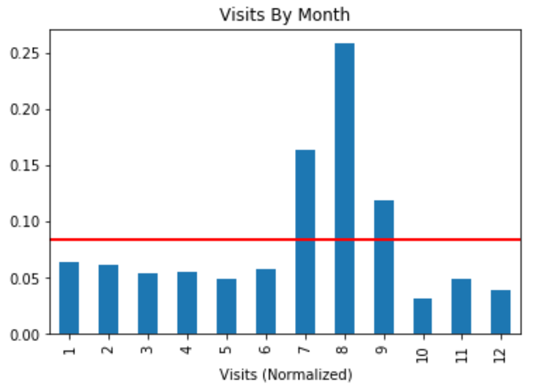
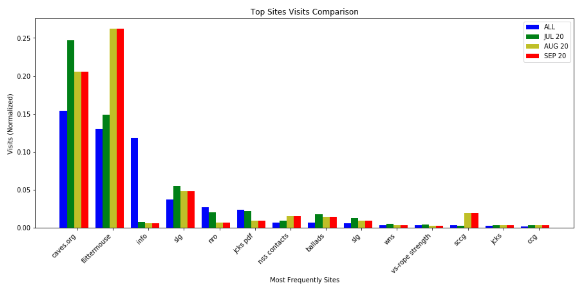

# NSS-Caves.org-Analysis-Apache

I am a passionate caver and a volunteer for the [National Speleological Society](caves.org) (NSS). Our website has a lot of amazing content and has been maintained by fellow volunteers for decades, however, we believe it is time for an update. I am on the website redesign committee along with several other cavers. The website had a Google Analytics account, but somehow we lost access to it and it could not be recovered, so I am analyzing these apache logs to get an idea of which pages are the most visited/useful, so that we can be sure to retain that content in the redesign.

## Data Wrangling
**nss_apache_logs jupyter notebooks:** First, I used regular expression to parse the apache logs (20GB) and write to a .csv file. The data spanned from May 2019-May 2020 (81,387,236 rows). I converted the .csv to a pandas dataframe and looked only at the caves.org domain (49,435,242 rows). Of the 81,387,236 requests made to the server, 49,435,242 were for caves.org, account for 60.74% of web traffic. Then I removed bots, crawlers, and other non-human traffic. Of the 49,435,242 requests to the caves.org server, 19,104,860 were from real users (i.e. not bots, scrapers, or indexers) and accounted for 38.65% of the total web traffic.

**caves_data_wrangling jupyter notebook:** Then I split the http_request column into multiple columns, removes the query request from the url, and further filtered the data to only look at successful get requests, and removes extraneous information that loads each time a website page is visited. I noticed one IP address accounted for 20% of the traffic--I had missed a crawler. 3,835,335 rows remained. Data now ready for analysis, I wrote to a .csv file (1 GB).

## Data Analysis (caves_analysis jupyter notebook)

### port
* port 80 count: 2744867
* port 443 count: 1090468
* Port 80 is public (http). Port 443 is secure (https).

### ip_address
* Unique IP addresses: 548,164
* Total traffic: 3,835,335
* Http requests per user: 7.0

### referrer & http_request
Of total traffic:
* 46% of traffic are from google searches
* 31% of traffic is from direct visitors
* 3% are from Rocky Mountain Region
* 2% are from visiting pages from caves.org
* 1% is from the JCKS Bulletin
Of 3,835,335 human visits to caves.org, 1,203,268 are direct visits (31.37%) and 2,632,067 were referred (68.63%).

Of direct traffic:
* 15% of traffic are from direct visits to caves.org/
* 13% Flittermouse Grotto
* 12% caves.org/info
* 4% a PDF of JCKS index (lots of notable names)
* 4% Salt Lake Grotto
* 3% Northeast Regional Organization
* 2% JCKS article PDF
* 1.5% cave ballads

Of referred traffic:
* ~60% of traffic is referred from Salt Lake Grotto (excluded from view)
* 2.6% from caves.org/
* <1%: vertical section, IO list, Shasta Area Grotto, Events, NSS Contacts PDF, JCKS, ACA, CaveFest, etc (see above)

Since Salt Lake Grotto drives a majority of referred traffic, I wanted to see what they were referring to. The traffic is going to other SLG pages and not to caves.org.

Traffic from Google accounts for 46% of referred traffic. Here is the breakdown of that traffic:
* 17% caves.org/
* 5% vertical section
* 2%: Cave Fest, Events
* 1%: see above

### user_agent
Top two browsers used are Windows Chrome and Linux Firefox.

### date_time
I parsed the strings to datetime objects.
* Start Date: 2019-05-12 06:43:03+00:40
* End Date: 2020-05-13 21:46:34+00:40

I extracted the month, day of week, and hour from date_time, then normalized the data for visual comparison. There doesn't appear to be any significance to the day of the week or anything unusual about the hours of activity. There is noticeable spike in website visits in July and peaks in August.

Because Salt Late City Grotto made up the majority of referred traffic, we're looking only at the percentage of traffic from them for referred data. There is a significant increase in their traffic in July, August, and September, which probably accounts for a portion of the overall increase in traffic in these three months.
* all-direct: 66%
* jul-direct: 80%
* aug-direct: 92%
* sep-direct: 92%

Given the high traffic from these 3 months and since Salt Lake City grotto makes up the majority of referred traffic, I wanted to dive deeper looking direct traffic and where it was going by counting the resource urls to determine frequency by timeframe. I selected several of the most frequency URLs that overlapped each timeframe (all, Jul 2019, Aug 2019, Sep 2019), then calculated and graphed the normalized frequency.

* caves.org: '[caves.org/](caves.org/)'
* flittermouse: '[caves.org/grotto/flittermouse/wp-login.php](caves.org/grotto/flittermouse/wp-login.php)'
* info: '[caves.org/info/](caves.org/info/)'
* slg: '[caves.org/grotto/slgrotto/phpbb2/rss.php](caves.org/grotto/slgrotto/phpbb2/rss.php)'
* nro: '[caves.org/region/nro/necaver_index3.html](caves.org/region/nro/necaver_index3.html)'
* jcks pdf: '[caves.org/pub/journal/PDF/V74/cave-74-02-221.pdf](caves.org/pub/journal/PDF/V74/cave-74-02-221.pdf)'
* nss contacts: '[caves.org/info/NSS_Contacts.pdf](caves.org/info/NSS_Contacts.pdf)'
* ballads: '[caves.org/committee/salons/ballads/Music/2005/](caves.org/committee/salons/ballads/Music/2005/)'
* slg: '[caves.org/grotto/sligo/index.htm](caves.org/grotto/sligo/index.htm)'
* wns: '[caves.org/WNS/](caves.org/WNS/)'
* vs-rope strength: '[caves.org/section/vertical/nh/50/knotrope-hold.html](caves.org/section/vertical/nh/50/knotrope-hold.html)'
* sccg: '[caves.org/grotto/sccg/sccg.php](caves.org/grotto/sccg/sccg.php)'
* jcks: '[caves.org/pub/journal/](caves.org/pub/journal/)'
* ccg: '[caves.org/grotto/ccg/](caves.org/grotto/ccg/)'

Caves.org had a significant increase in traffic Jul-Sep. Interestingly, caves.org/info decreased signficantly during this same time. Flittermouse and SCCG had a significant increase in traffic in Aug-Sep. The other sites don't appear to have significant increases or decreases.

The driving factors in the increase of overall traffic from Aug-Sep seems to be:
* SLG referred traffic
* Flittermouse direct traffic (Aug-Sep)
* Caves.org direct traffic (Jul-Sep)

Perhaps SLG and Flittermouse had some kind of event during this time. I'd like to think the NSS Convention spurred the increase in traffic on the NSS main site during this timeframe.

## Creator
[Sonia Meyer](https://github.com/soniawmeyer)
